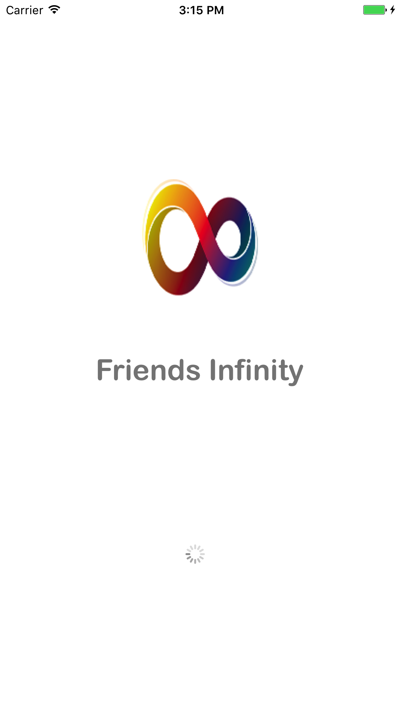
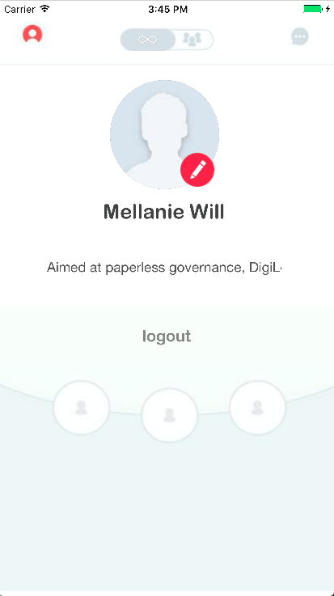

#  Friends Infinity

  Friends Infinity is a IOS App. Apple Swift version 3.1 (swiftlang-802.0.48 clang-802.0.38) is used for developing. 
  Friends Infinity look and features like Tinder App .
  
### Features
  1. Firebase Authentication Used.
  2. User create own account and login.
  3. Search random friends like tinder.
  4. send friend request to any one from suggestion list.
  5. user can also received the friend request.
  
## Basic Usage 

```markdown

  git clone https://github.com/technolabshq/FriendsInfinity.git
  cd FriendsInfinity
  open FriendsInfinity.xcworkspace
  
```


## FriendsInfinity Screenshot for Overview

 &nbsp; &nbsp; &nbsp; &nbsp; &nbsp;&nbsp; &nbsp; &nbsp; &nbsp; &nbsp; &nbsp; &nbsp; &nbsp; &nbsp; &nbsp;&nbsp; &nbsp; &nbsp; &nbsp; &nbsp; 
 

&nbsp; &nbsp; &nbsp; &nbsp; &nbsp;&nbsp; &nbsp; &nbsp; &nbsp; &nbsp; &nbsp; &nbsp; &nbsp; &nbsp; &nbsp;&nbsp; &nbsp; &nbsp; &nbsp; &nbsp; 


&nbsp; &nbsp; &nbsp; &nbsp; &nbsp;&nbsp; &nbsp; &nbsp; &nbsp; &nbsp;&nbsp; &nbsp; &nbsp; &nbsp; &nbsp;&nbsp; &nbsp; &nbsp; &nbsp; &nbsp; 


&nbsp; &nbsp; &nbsp; &nbsp; &nbsp;&nbsp; &nbsp; &nbsp; &nbsp; &nbsp; &nbsp; &nbsp; &nbsp; &nbsp; &nbsp;&nbsp; &nbsp; &nbsp; &nbsp; &nbsp; 


